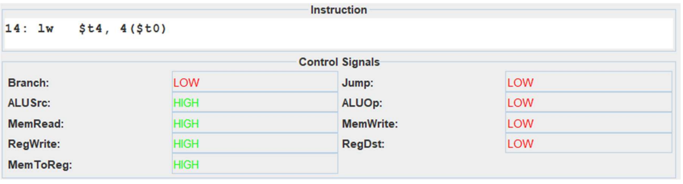

# Control Unit Analyzer Tool for MARS
The control unit in the MIPS datapath is a part of CPU and functional unit and a part of CPU. The control unit interprets the instruction and generates a set of control signals, in sync with the clock. The signals are responsible for determining which devices and operations will be involved in processing the instruction and the sequence of path to be followed. In the standard processor for the MIPS subset, the following control signals are involved. 

- `Branch`: Enables the loading of the branch target address, via a conditional test into the Program Counter.
- `Jump`: Enables the loading of the jump target address into the Program Counter.
- `ALUSrc`: Selects the second source operand for the ALU. Determines whether the second operand for the ALU comes from the `rt` register or from the sign extended immediate field.
- `ALUOp`: Specified whether that the ALU operation to be performed should be determined from the function bits.
- `MemRead`: Enables the memory read for load type instructions.
- `MemWrite`: Enabled the memory write for store type instructions.
- `RegWrite`: Enables the write to one of the registers (as specified).
- `RegDst`: Determines how the destination register is specified. Is high if 3 registers(`rs`, `rt`, `rd`) are involved.
- `MemToReg`: Determines whether the value to be written to the register comes from the ALU result or from the memory. 


## Tool Description
The tool involves 4 panels, as shown in the screenshot below. The tool has been tested on the standard Fibonacci MIPS code, from the MARS official website. 


### Instruction
The first panel prints the current instruction, that has already been executed, in the text area. The format is `[Line Number:] The instruction including comments`. Pseudo-instructions are handled differently. The pseudo instruction is printed verbatim twice(or the number of real instructions involved underneath), with the same line number, instead of the underlying real instructions involved in it.

For instance, for a li $s0, 100, on line 9. The following will be printed. 
```asm
9: li $s0, 100
``` 
Instead of,
```asm
9: addiu $s0, $0, 100 
```

### Control Signals
Tells which control signals are going to be high. For each instruction, it has three states, `HIGH`, `LOW`, or `Don’t Care`. For example, for a load word instruction, we have,


### Runtime Log
This panel creates a run-time log, if enabled. It generates and keep a log file for the control signals of all the past lines. Disabling the check box, erases the log. A high signal is denoted by `1`, a low signal is denoted by `0` and a don't care by `x`


A sample log till, line 15 for the sample code is as follows.

```txt
[Line: 0] :: Branch: 0 Jump: 0 ALUSrc: 0 ALUOp: 0 MemRead: 0 MemWrite: 0 RegWrite: 0 RegDst: 0 MemToReg: 0 
[Line: 6] :: Branch: 0 Jump: 0 ALUSrc: 1 ALUOp: 0 MemRead: 0 MemWrite: 0 RegWrite: 1 RegDst: 0 MemToReg: 0 
[Line: 6] :: Branch: 0 Jump: 0 ALUSrc: 1 ALUOp: 0 MemRead: 0 MemWrite: 0 RegWrite: 1 RegDst: 0 MemToReg: 0 
[Line: 7] :: Branch: 0 Jump: 0 ALUSrc: 1 ALUOp: 0 MemRead: 0 MemWrite: 0 RegWrite: 1 RegDst: 0 MemToReg: 0 
[Line: 7] :: Branch: 0 Jump: 0 ALUSrc: 1 ALUOp: 0 MemRead: 0 MemWrite: 0 RegWrite: 1 RegDst: 0 MemToReg: 0 
[Line: 8] :: Branch: 0 Jump: 0 ALUSrc: 1 ALUOp: 0 MemRead: 1 MemWrite: 0 RegWrite: 1 RegDst: 0 MemToReg: 1 
[Line: 9] :: Branch: 0 Jump: 0 ALUSrc: 1 ALUOp: 0 MemRead: 0 MemWrite: 0 RegWrite: 1 RegDst: 0 MemToReg: 0 
[Line: 10] :: Branch: 0 Jump: 0 ALUSrc: 1 ALUOp: 0 MemRead: 0 MemWrite: 1 RegWrite: 0 RegDst: x MemToReg: x
```

### Statistics
Shows the statistics for each of the control signals, the number of times each signal has been high and also generates a horizontal bar graph based on the statistics, to show the relative number of times each signal has been high.


## License
- The original [MARS LICENSE]()

## Source
The source code was extracted using `jar xf Mars4_5.jar`.


## Compiling and Creating the JAR File
Still to compile and create a JAR executable, run the batch file, `CreateMarsJar.bat`. 